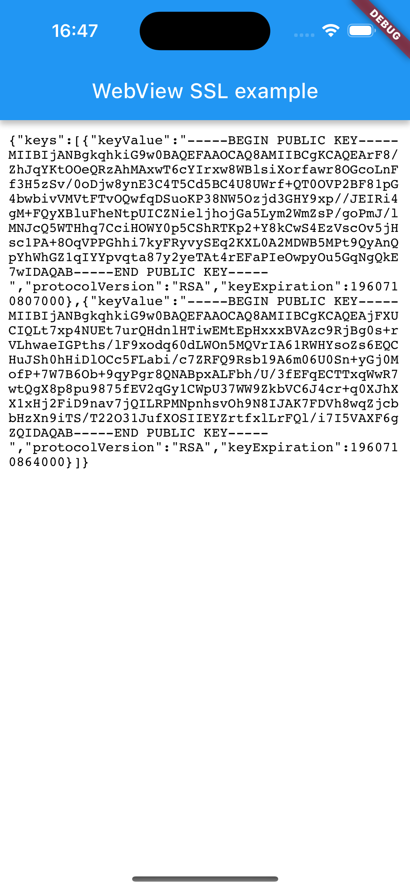
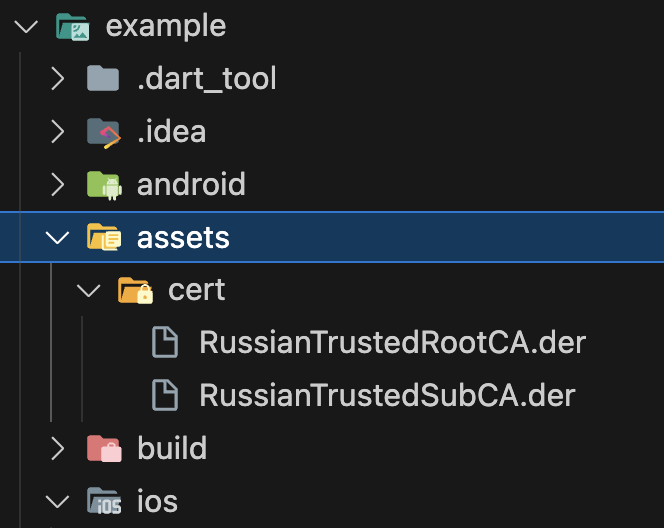

# Flutter WebView Plugin with SSL Certificates for IOS

Add to Info.plist:

```
<key>NSAppTransportSecurity</key>
<dict>
    <key>NSAllowsArbitraryLoadsInWebContent</key>
    <false/>
    <key>NSExceptionDomains</key>
    <dict>
    <key>sberbank.ru</key>
    <dict>
        <key>NSIncludesSubdomains</key>
        <true/>
        <key>NSExceptionAllowsInsecureHTTPLoads</key>
        <true/>
        <key>NSExceptionRequiresForwardSecrecy</key>
        <false/>
    </dict>
    <!-- add more domain here -->
    </dict>
</dict>
```

Flutter part:

```
Scaffold(
    appBar: AppBar(
        title: const Text('WebView SSL example'),
    ),
    body: WebViewSSL(
        initialUrl: 'https://3dsecmt.sberbank.ru/payment/se/keys.do',
        sslAssets: const [
            'assets/cert/RussianTrustedRootCA.der',
            'assets/cert/RussianTrustedSubCA.der',
        ],
        onNavigate: (url) {
            if (url.contains('wikipedia.org')) {
                print('URL decline: $url');
                return WebViewSSLNavigation.decline;
            }
            print('URL allow: $url');
            return WebViewSSLNavigation.allow;
        },
        onError: (error) {
            print('ERROR: $error');
        },
    ),
)
```


   
